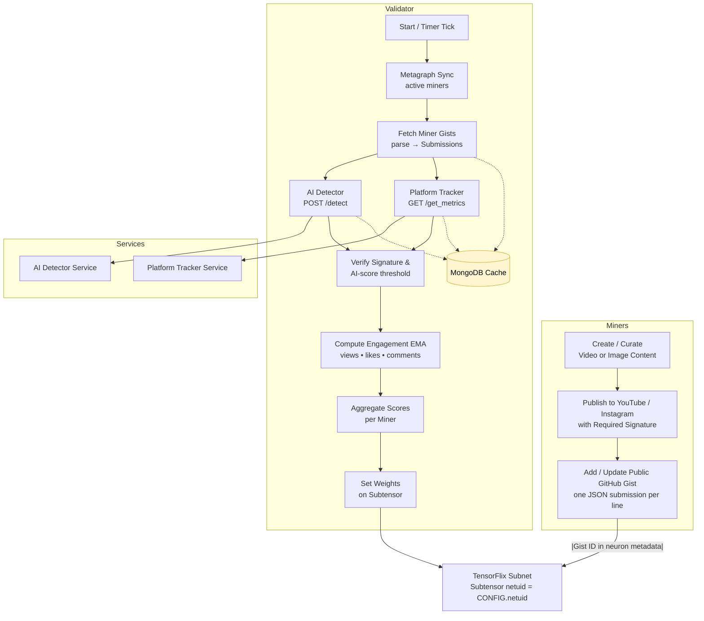

# InfiniteVibe Media Production and Streaming

InfiniteVibe is an AI‐driven video and media studio putting Bittensor at the frontier of AI-Generated video production. 

Miners respond to tasks and create AI Generative video using any model or means at their own disposal. Miner scoring and emissions are determined by real world user feedback e.g. paying for the SN output or views/engagement. As a way to grow awareness and attract the worlds best creatives to SN89, the SN will first reward miners based on submissions engagement on the miner's own social media profiles. We will funnel traffic to infinitevibe.ai and tensorflix.ai - where a Beta list of organic tasks is being populated waiting for the SN reach quality output.

Validators act as editor/producers, ensuring that miner quality progresses to the highest levels. Our near-term goal is to align Validators closely with creators, and as such Miners will be expected to post collateral - and jointly this entities can produce and monetize high quality media and perhpas full length series and film. 

To ensure that economic incentives are aligned on quality SN output and to disincentivize cheating, Validators will receive monetization reveneus (fiat) relative to their alpha stakeweight, and Miner rewards will be in part weighted on collateral. 

## Creative Direction

Our goal is to give miners as much creative freedom and incentive to push the boundries of AI video production. Miners will be especially free to explore, and thus SN output more unweilding, at te start of the project when the fewest guardrails will be present. Our initial goal is to cast the broadest net and creatives and notariety from the media industry. Eventually miner tasks will have more defined and miners will need to interpret signals from the market and create accordingly. The SN goal and basis for policies will be to let the market drive the creative direction we go in - and NOT centralize style and content decisions.

Starting with bite-size creative tasks, InfiniteVibe creative network will fine tune to become a full fledged media production studio. AI is rewriting the book (again) on Hollywood and big Media-Tech, and this time Bittensor and InfiniteVibe will become the leader as a distributed, decentralized, and ultimately THE MOST CREATIVE power player.

## Overview

InfiniteVibe implements a decentralized content creation and validation pipeline:
- **Miners** submit video content to the SN and post the content on social media, and eventually the TensorFlix website
- **Validator**  score submissions by their engagement on the video traffic. Validators also: verify content is 100% AI generated, zero illicit content, traffic is real/not bots. 
- **Coordination** happens through Bittensor blockchain and GitHub gists

## Quick Start

- [Validating](docs/validating.md)
- [Mining](docs/mining.md)
- [How the Subnet Works](docs/how-subnet-works.md)

