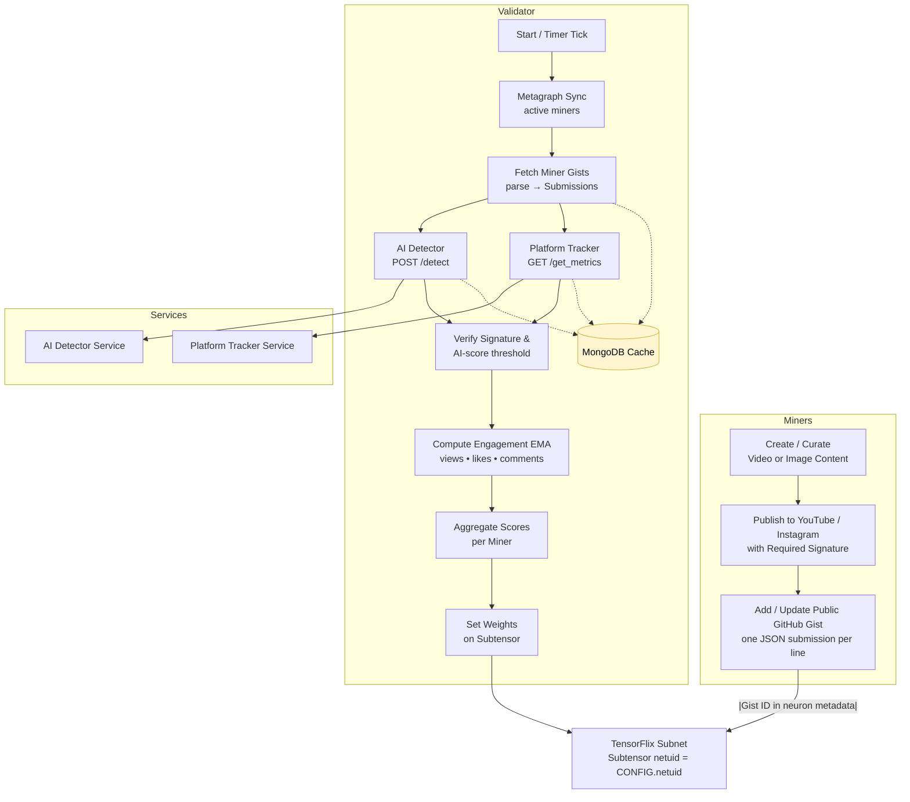

# InfiniteVibe.ai - Media Production and Streaming

AI Video and media studio, where creators (miners) are incentivized to invest in and refine their own creative AI skills and tools, to expand the horizons of AI video production. 

Miner respond to tasks and create AI Generative video or other artifacts generated either organically by paying users or synthetically by the SN owner. Rewards are determined either by the user choosing the miner's work, or in the case of synthetic tasks, the views/engagement of each miner submission. As a way to grow awareness of the Subnet and Bittensor, and attract the worlds best creatives, miners will start with a synthetic task(s) and rewarded based on engagement on the miner's own social media profile. This "staging content" will be used to drive traffic to our sites, infinitevibe.ai and tensorflix.ai - for later monetization and organic tasks.

Validators act as editor/producers, ensuring that miner quality progresses to the highest level. To ensure that incentives are aligned, Validators will receive reveneus in addition to Alpha, pro-rata with their Stakeweight. Our near-term goal is to align Validators closely with creators, and as such Miners will be expected to post collateral - and jointly this entities can produce and monetize high quality media and perhpas full length series and film. 

## Creative Direction

Our goal is to give miners as much creative freedom as possible. This will be especially evident at the start of the project when only a few guardrails will be present and the focus is on viralization of Subnet 89 and Bittensor. Again our goal at launch is to cast the broadest net to attract thousands of creatives and notariety from the media industry and drive traffic to our sites. Eventually user generated organic tasks with defined visions will be created for miners and winners will be those who make the best interpretation. In summary, we will let the market will drive content creation.

Starting with smaller, more digestable tasks, InfiniteVibe will eventually evolve and grow to become a full fledged media production studio. AI is rewriting the book (again) on Hollywood and big Media-Tech, and this time Bittensor and InfiniteVibe will become the leader as a distributed, decentralized, and ultimately THE MOST CREATIVE power player.

## Overview

InfiniteVibe implements a decentralized content creation and validation pipeline:
- **Miners** submit video content to the SN and post the content on social media, and eventually the TensorFlix website
- **Validator**  score submissions by their engagement on the video traffic. Validators also: verify content is 100% AI generated, zero illicit content, traffic is real/not bots. 
- **Coordination** happens through Bittensor blockchain and GitHub gists

## Quick Start

- [Validating](docs/validating.md)
- [Mining](docs/mining.md)
- [How the Subnet Works](docs/how-subnet-works.md)

